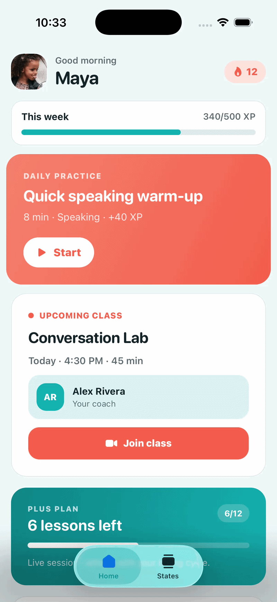
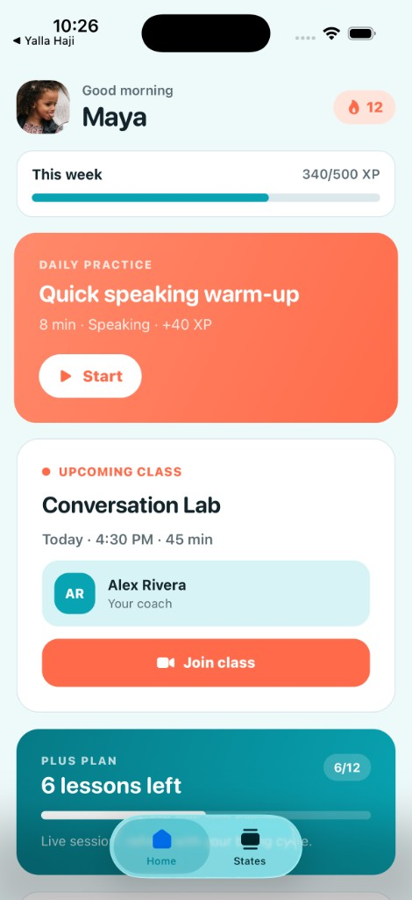
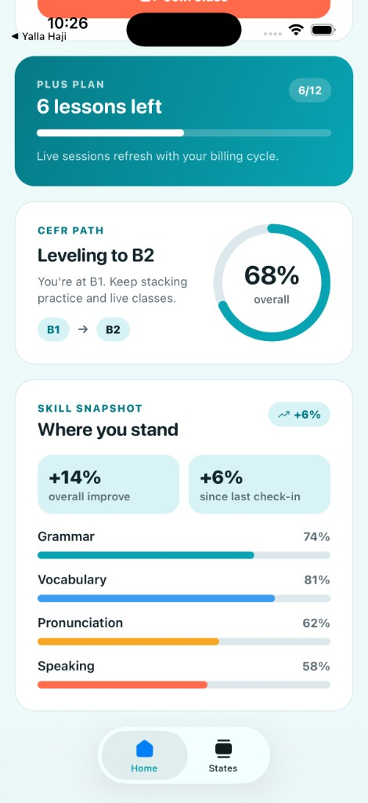
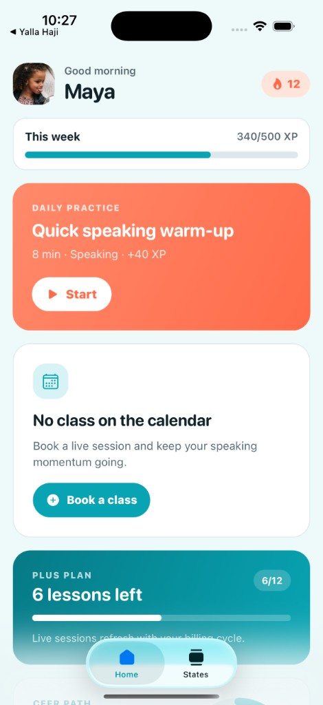
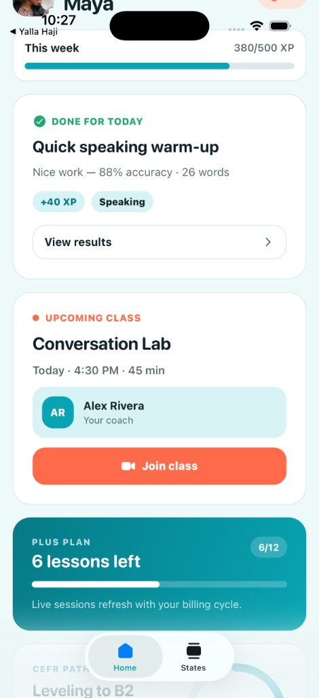
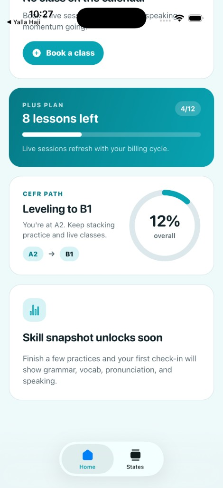
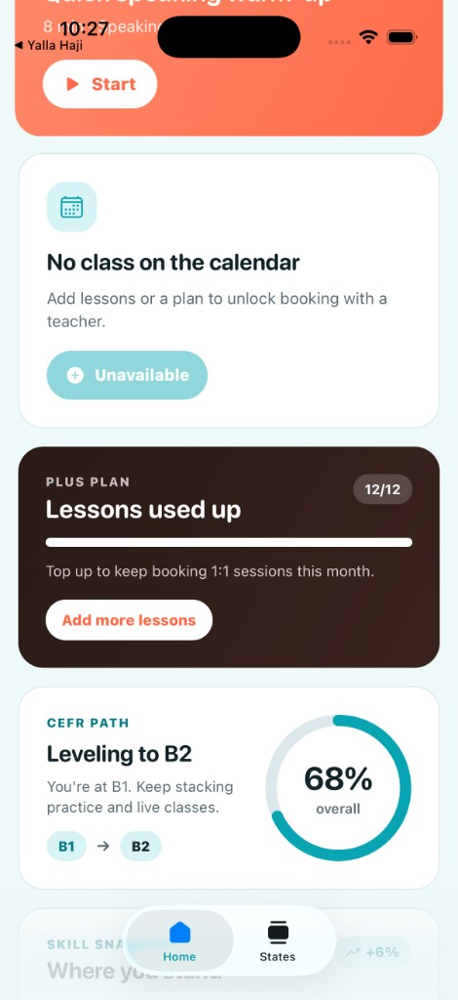
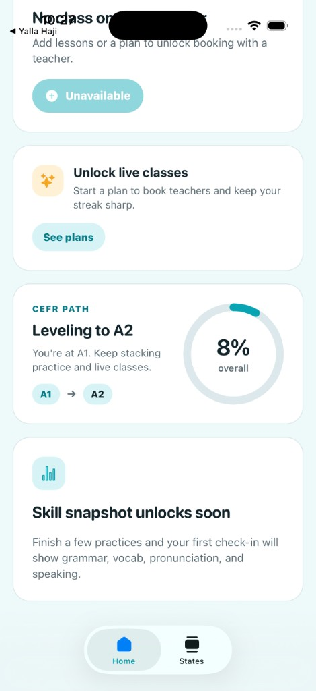

# Skillio — Home Screen

React Native (Expo) take-home for Skillio’s student home screen — UI/UX focused EdTech experience for learners aged **10–20**.

Energetic and personal, not a corporate dashboard. Palette starts from **`#08A4B3`** + white, with coral accents for primary actions.

## Demo



## Screenshots

### Default — class booked, practice waiting



### Progress & skill snapshot



### No class scheduled



### Practice done — view results



### New learner — no skill data yet



### No lessons remaining



### No active subscription



## What’s on the home screen

| Area | Behaviour |
| --- | --- |
| **Daily practice** | Start when incomplete · View results when done |
| **Class status** | Join when scheduled · Book CTA (or locked) when not |
| **Subscription** | Tier + lessons remaining · top-up / see-plans edge states |
| **Progress** | Current → next CEFR level + animated overall % |
| **Skill snapshot** | Grammar, vocab, pronunciation, speaking + growth |

Use the **States** tab to flip demo scenarios; Home updates live with entrance animations.

## Extra fields (beyond the brief schema)

| Field | Why |
| --- | --- |
| `streakDays` | Quick habit motivator next to the greeting |
| `weeklyXp` / `weeklyXpGoal` | Soft weekly goal without overcrowding the screen |
| `dailyPractice.title`, `estimatedMinutes`, `focusSkill`, `xpReward` | Enough for a clear Start state |
| `dailyPractice.scorePercent`, `wordsPracticed` | Enough for a View Results state |
| `scheduledClass.durationMinutes`, `meetingId` | Join context without extra screens |

## Design & polish

- Teal brand `#08A4B3`, coral CTAs, soft teal-mist background
- Light + dark via system color scheme
- Micro-interactions: staggered fade-ins, progress ring, skill bars, practice pulse, press scale + haptics

## Run locally

```bash
npm install
npx expo start
```

Then open iOS Simulator, Android emulator, or Expo Go.

```bash
npx tsc --noEmit   # typecheck
npx expo lint      # lint
```

## Project layout

```
src/
  app/                 # Expo Router screens (Home, States)
  components/home/     # Home UI sections
  context/             # Demo scenario provider
  data/home-mock.ts    # Hardcoded scenarios
  types/home.ts
docs/
  screenshots/         # Key UI states
  demo/                # Screen recording (GIF)
```

## Evaluation focus (from the brief)

UI/UX judgment and execution — information hierarchy, how the interface feels, and polish of animations / micro-interactions. Edge and empty states are intentional bonus coverage.
